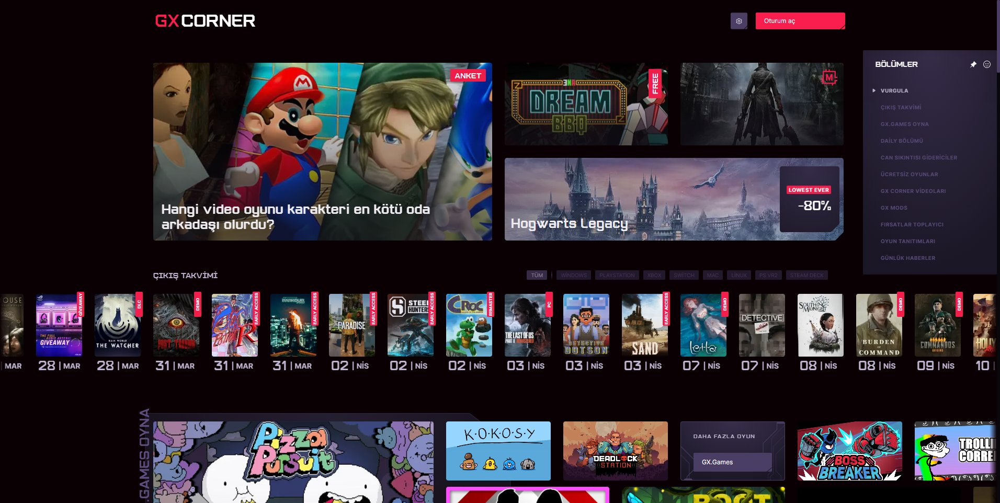

# GXCorner for All
#### Access GXCorner with any browser

## Get it on
<ul>
  <li>
  <a href="https://chromewebstore.google.com/detail/gxcorner-for-all/mlhkagcfcpcpncjofpneokajfcjpncip">
    
    Chrome Web Store
  </a>
  </li>
  <li>
  <a href="https://addons.mozilla.org/tr/firefox/addon/gxcorner-for-all/">
    
    Firefox Add-Ons
  </a>
  </li>
</ul>

This is a browser extension that only sets some variables for only "gxcorner.games" page's javascript context. None of your information is collected.

